<p align="center">
  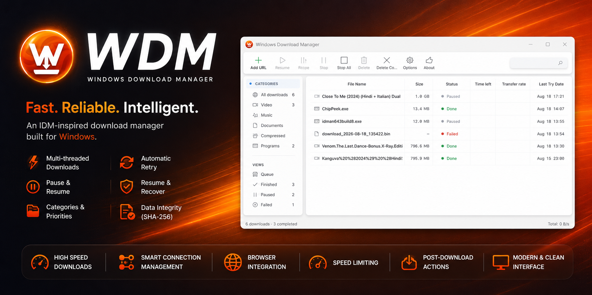
</p>

# WDM — Windows Download Manager

An IDM-inspired no-nonsense download manager for Windows, written in C# / WPF / .NET 8. **Self-contained .NET 8** — exe releases bundle all libraries, no runtime install needed.

- **Multi-threaded downloads** — dynamic segmentation with a shared chunk pool: the file is divided into small byte-range chunks that any worker thread can pick up as they finish, so slower segments don't idle threads.
- **Pause / Resume** — the set of completed chunks is persisted to a `*.wdmstate` file next to the target; resuming skips chunks already on disk and continues from there, even across restarts.
- **Automatic retry** — transient failures and HTTP 408/429/5xx responses are retried with exponential backoff.
- **Browser download catching** — a small Chrome/Edge/Firefox extension (Manifest V3) intercepts downloads and hands them to WDM over a localhost server (`http://127.0.0.1:17530`).
- **YouTube & media sites** — powered by [yt-dlp](https://github.com/yt-dlp/yt-dlp): resolve videos, audio and playlists, pick a quality tier (up to 4K, or audio-only MP3/M4A), and authenticate with cookies from your browser or a built-in WebView2 YouTube sign-in.
- **HLS streaming downloads** — `.m3u8` manifests are downloaded as a single media file: master/media playlists, AES-128 segment decryption, TS and fMP4 segments, 8 concurrent segments.
- **Speed limiting** — per-download and global throughput limits.
- **Priorities & categories** — Low/Normal/High priority that reorders the queue, and automatic categorization by file extension with optional per-category save folders.
- **Post-download actions** — optional SHA-256 checksum computation and a script/command to run on completion.
- **Light & dark themes**, two visual styles, tray icon with progress flyout, and automatic update checks against GitHub Releases.

## Structure

```
WDM/
  WDM.sln
  build-xpi.ps1             # packages the Firefox extension as wdm-catcher.xpi
  src/
    WDM/                    # WPF app (.NET 8)
      Models/               # DownloadTask, TaskStatus, PriorityLevel, DownloadCategory
      Services/             # DownloadEngine (chunked downloads), HlsDownloader,
                            # MediaResolver + YtDlpRunner + EngineManager (yt-dlp/ffmpeg),
                            # CaptureServer (localhost listener), TaskStore (JSON persistence),
                            # SpeedGovernor, ThemeService, TrayIcon, UpdateChecker
      ViewModels/           # MainViewModel, commands, converters
      Controls/             # custom window chrome
      Themes/               # dark/light palettes + two UI themes
    WDM.BrowserExtension/   # Manifest V3 extension for Chrome/Edge
      firefox/              # Firefox-specific variant (background event page)
    WDM.Setup/
      installer.iss         # Inno Setup installer script
```

## Build

Requires the [.NET 8 SDK](https://dotnet.microsoft.com/download/dotnet/8.0) and Windows.

```
dotnet build WDM.sln
dotnet run --project src/WDM
```

The app listens on `http://127.0.0.1:17530` for browser download requests.

### Media engines

YouTube/HLS features rely on `yt-dlp.exe`, `ffmpeg.exe`/`ffprobe.exe` and optionally `qjs.exe`
(QuickJS). WDM looks for them next to the app (`engines\` seed folder), in `%LocalAppData%\WDM\bin`,
and on `PATH`; anything missing is downloaded automatically on first use.

## Install the browser extension

WDM has no effect on the browser until the extension is installed.

- **Chrome / Edge**: go to `chrome://extensions` (Edge: `edge://extensions`), enable *Developer mode*, click *Load unpacked*, and select `src/WDM.BrowserExtension`. WDM also ships a copy of the extension in its output folder (`BrowserExtension\`) and shows a step-by-step guide from within the app.
- **Firefox**: go to `about:debugging#/runtime/this-firefox`, click *Load Temporary Add-on*, and select `src/WDM.BrowserExtension/firefox/manifest.json`.

With WDM running, any download the browser starts is cancelled by the extension and sent to WDM instead. If WDM is not running, the download falls back to the browser's own downloader.

### Building the Firefox XPI

```
powershell -File build-xpi.ps1 [-SignedXpi <path-to-signed.xpi>]
```

Produces `staging/BrowserExtension/wdm-catcher.xpi`. The self-built XPI is **unsigned** and will not install in release builds of Firefox — upload it to [addons.mozilla.org](https://addons.mozilla.org/developers/) (self-distribution is free) and pass the signed file back via `-SignedXpi` to bundle it.

## Installer (optional)

Requires [Inno Setup 6](https://jrsoftware.org/isinfo.php). Publish the app into `staging\`, then compile:

```
ISCC.exe src\WDM.Setup\installer.iss
```

Output: `output\WDM_Setup_<version>.exe`. Per-user install into `%LocalAppData%\WDM`, with optional desktop icon and start-with-windows (launches minimized to the tray via `/minimized`) tasks.

## How the download engine works

1. `DownloadEngine.ProbeAsync` sends a `HEAD` request, falling back to a ranged `GET bytes=0-0`, to learn the file size and whether the server supports ranges.
2. If ranges are supported, the file is divided into chunks (`totalBytes / (chunks × 8)`, clamped to 128 KiB–16 MiB). A shared counter hands out chunk indexes to N worker threads, so any thread picks up the next incomplete chunk the moment it finishes one.
3. Each chunk is fetched with `Range: bytes=from-to` and streamed into the preallocated output file at its byte offset; the completion bitmap is flushed to `*.wdmstate` (JSON) so partial progress survives crashes.
4. On resume, `ChunkState.Load` validates the state file's magic, total bytes, chunk size and chunk count, then workers skip already-completed chunks.
5. `RunSingleStreamAsync` is the fallback when the server doesn't support ranges or the size is unknown; it also retries on failure. `.m3u8` URLs are routed to `HlsDownloader` instead.
6. A timer samples bytes/sec to drive the speed and ETA shown in the UI.

## Updates (delta / patch-only)

* **Velopack delta updates** (preferred): when WDM is installed via Velopack, `src/WDM/Services/VelopackUpdateService.cs:13` checks `https://github.com/usm007/WDM/releases` for `*.nupkg` + `RELEASES`. `Velopack.UpdateManager` downloads only the binary diff (`Delta ~1-5 MB` vs full `~60 MB`) and `ApplyUpdatesAndRestart` applies it silently — no Inno wizard, no full `WDM_Setup_*.exe` prompt. `App.xaml.cs:35` calls `VelopackApp.Build().SetAutoApplyOnStartup(true).Run()` to handle hooks and auto-apply pending deltas on next launch. Works per-user (`%LocalAppData%\WDM`), no UAC, preserves `WebView2` profile / `tasks.json` / `engines\`.
* **Fallback**: dev builds and legacy Inno-only installs (`VelopackUpdateService.IsVelopackInstalled == false`) fall back to `src/WDM/Services/UpdateChecker.cs:37` GitHub Releases API. The full installer is downloaded to `%TEMP%` and launched. Even this path can be silent via `UpdateChecker.LaunchInstallerSilent()` (`/VERYSILENT`).
* Hybrid release: publish both `WDM_Setup_<version>.exe` (Inno, new users) + Velopack assets (`WDM-<version>-full.nupkg`, `*-delta.nupkg`, `RELEASES`) to the same GitHub Release.

Build Velopack release (self-contained .NET 8, requires `vpk` CLI: `dotnet tool install -g vpk`):
```
dotnet publish src/WDM/WDM.csproj -c Release -r win-x64 --self-contained true -o publish
vpk pack --packId WDM --packVersion 2.5.4 --packDir publish --mainExe WDM.exe --outputDir output
# upload output/RELEASES + *.nupkg to GitHub Release alongside WDM_Setup_2.5.4.exe
# Or use: powershell -File build-velopack.ps1  (now defaults to self-contained, ~150MB, no .NET install needed)
```

## Caveats

- Resume needs the server to support byte ranges; otherwise a resumed download restarts the file.
- Only Windows is supported (by design).

## Screenshots

> Fresh captures from `v2.6.0` — light theme shown. Full gallery (light + dark, all 17 dialogs/tabs) in [`screenshots/README.md`](screenshots/README.md).

<p align="center">
  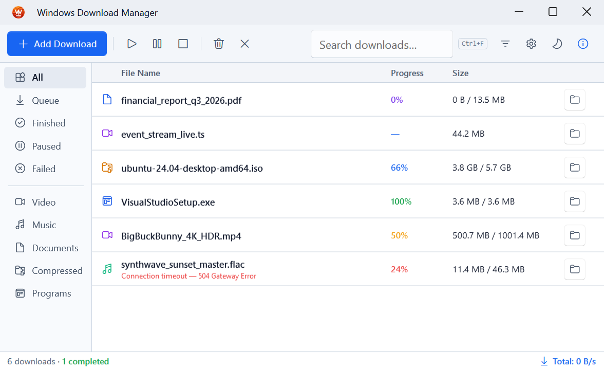
  <br/>
  <em>Main Window — modern fluent UI, categories, speed graph and toolbar</em>
</p>

### Featured — Light & Dark pairs (from latest captures)

| View | Light | Dark |
|---|---|---|
| **Download Progress** — `ubuntu-24.04-desktop-amd64.iso` · 3.8/5.7 GB · 66% · HLS segments · 17.6 MB/s · 1m 45s · 8 threads | 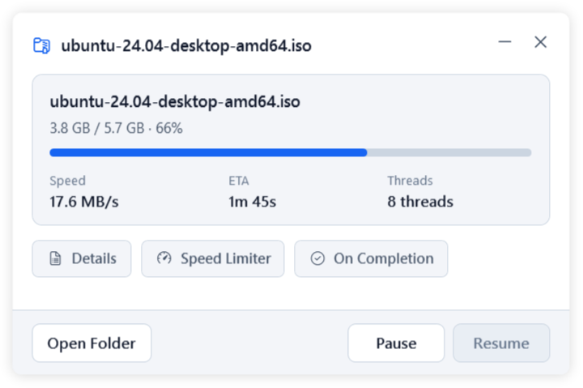 | 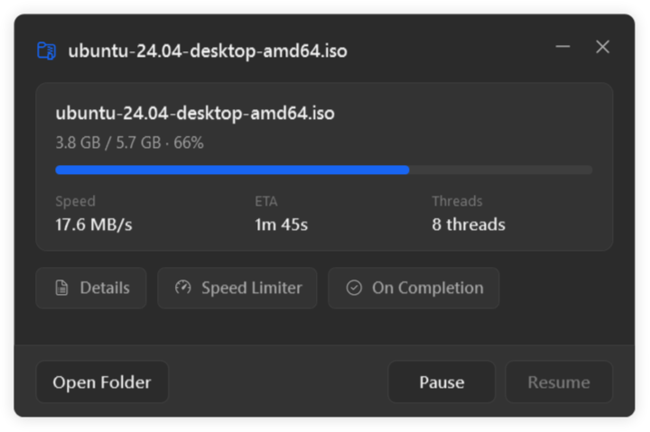 |
| **Main Window** — 5 downloads · Queued / Running / Done / Paused / Failed |  | 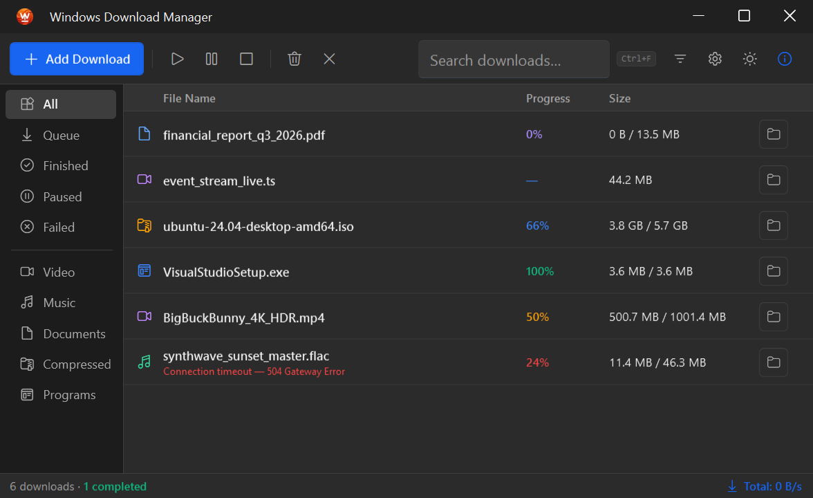 |
| **Add Download** — URL inspect + duplicate warning `This URL is already in your download list` | 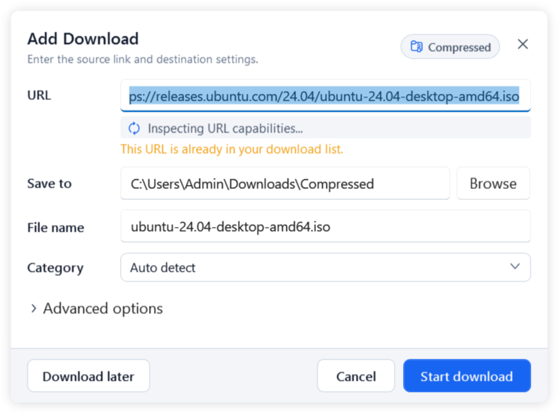 | 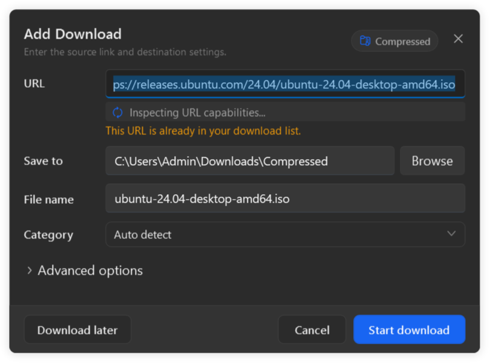 |
| **Settings** — Connection & Speed (Light) / YouTube & Media (Dark) |  | 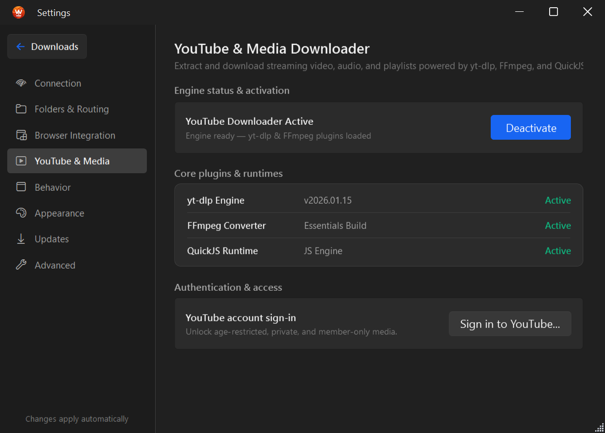 |
| **About** — `Version 2.6.0` · `github.com/usm007/WDM` | 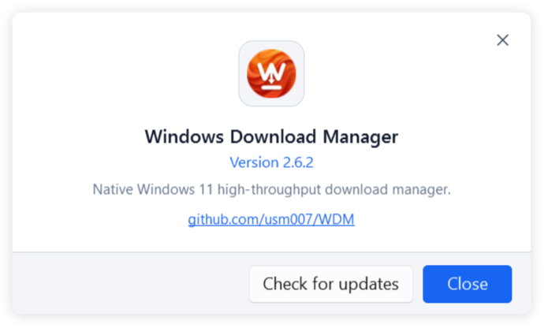 | 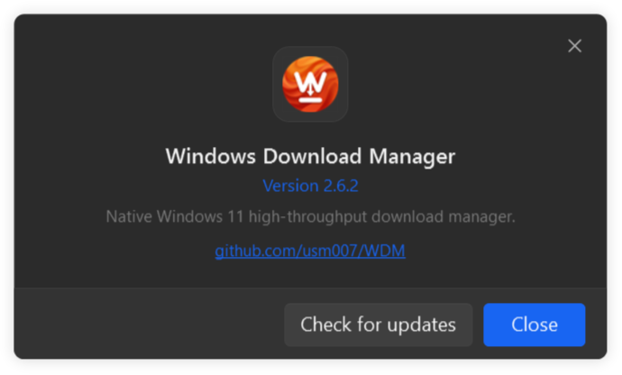 |

### Gallery — all dialogs (light)

| Add Download | Options | About |
|---|---|---|
|  | 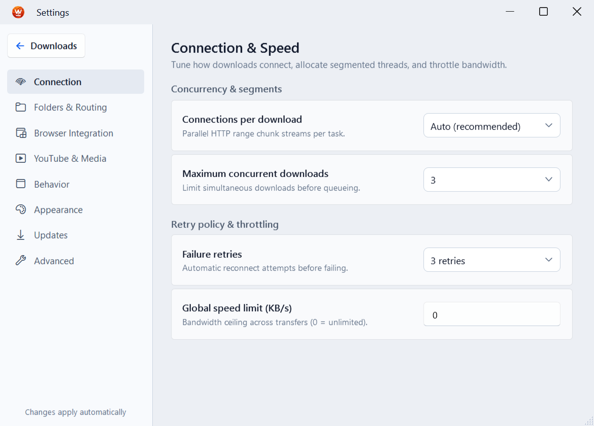 |  |

| Download Progress | Duplicate Check | Task Properties |
|---|---|---|
|  | 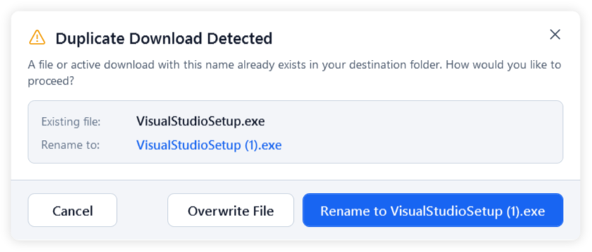 | 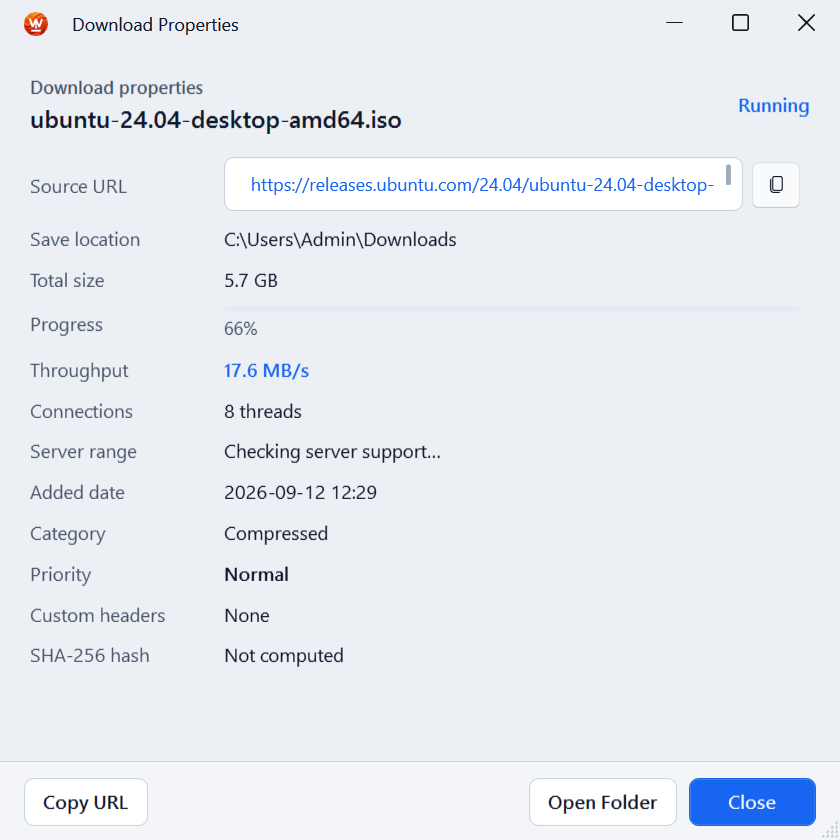 |

| Browser Extension | Welcome | Update (inline) |
|---|---|---|
| 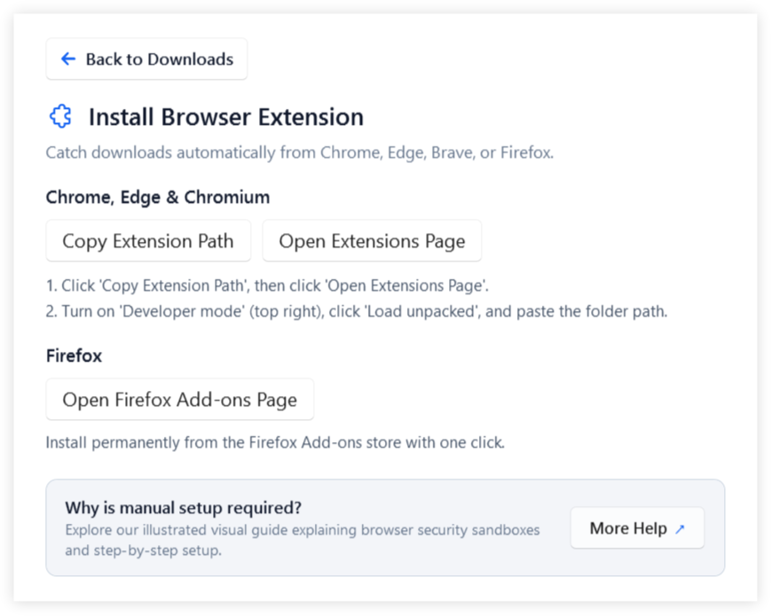 | 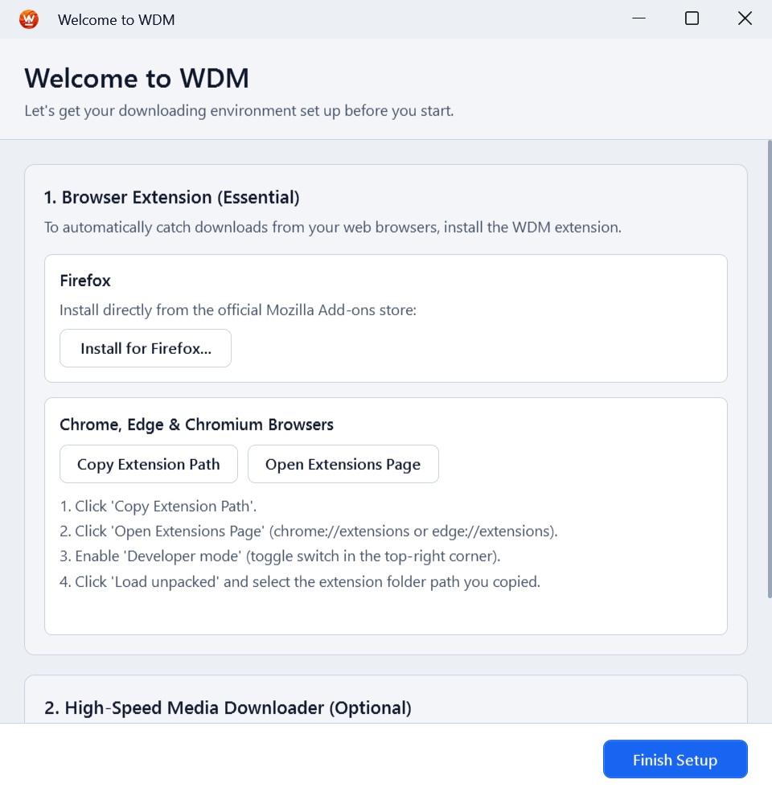 | 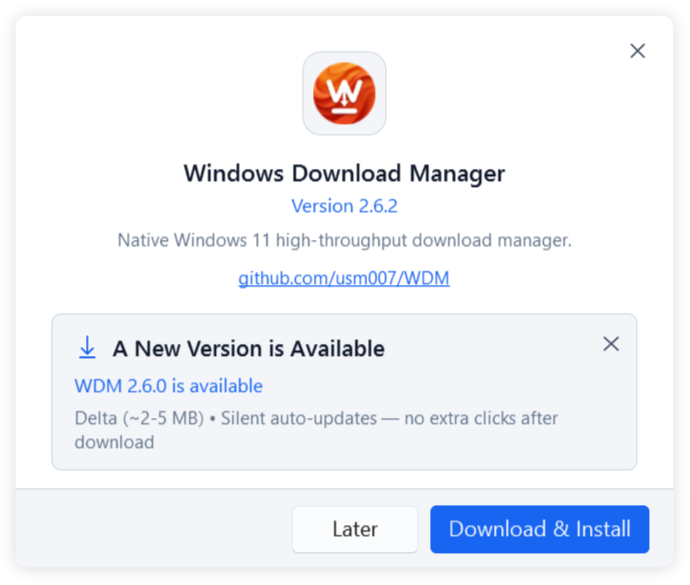 |

<details>
<summary>View all 17 dialogs + 8 Options tabs (light / dark)</summary>

See [`screenshots/README.md`](screenshots/README.md) for the complete table:
`01_MainWindow` · `02_AddDownloadDialog` · `03_OptionsDialog` (+ 8 tabs) · `04_AboutDialog` · `05_DownloadProgressDialog` · `06_DownloadCompleteDialog` · `07_DuplicateDownloadDialog` · `08_TaskPropertiesDialog` · `09_RefreshLinkDialog` · `10_DeleteConfirmDialog` · `11_BrowserExtensionDialog` · `12_ExtensionReloadNoticeDialog` · `13_WelcomeWindow` · `14_AboutDialog_Update` · `15_CloudflareChallengeWindow` · `16_YouTubeSignInWindow` · `17_TrayProgressPanel`

Light: `screenshots/light/` · Dark: `screenshots/dark/`

</details>
